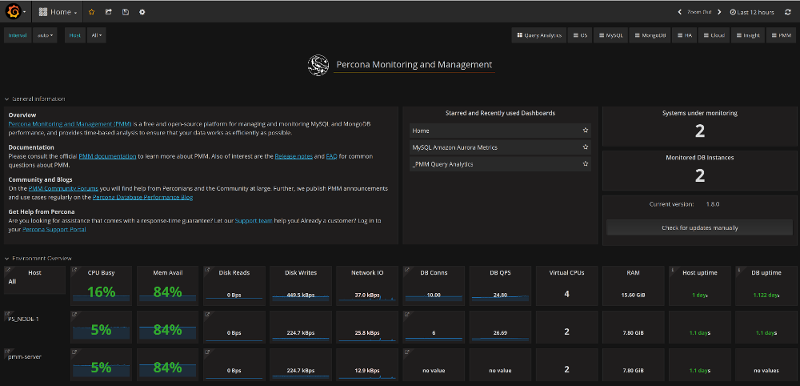
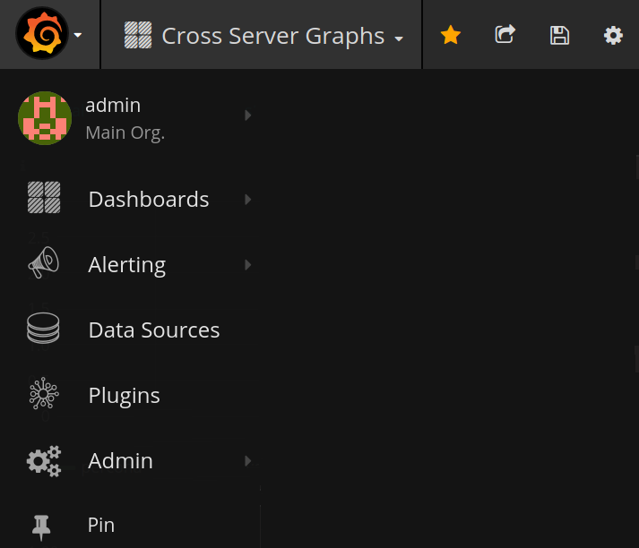
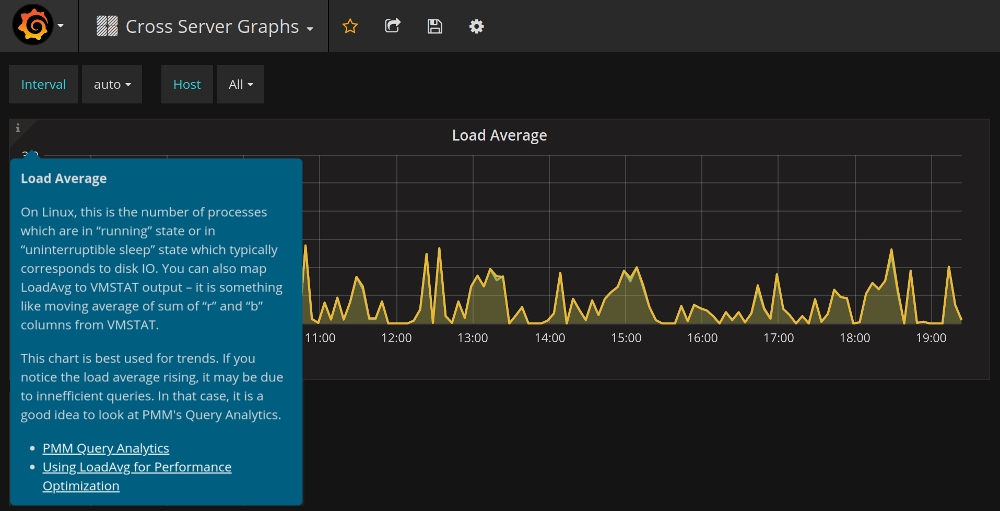

# Percona Monitoring and Management 1.8.0

* **Date**

    February 27, 2018

Percona announces the release of Percona Monitoring and Management 1.8.0.  Percona Monitoring and Management is a free and open-source platform for managing and monitoring MySQL and MongoDB performance.  You can run PMM in your own environment for maximum security and reliability. It provides thorough time-based analysis for MySQL and MongoDB servers to ensure that your data works as efficiently as possible.

This release introduces many improvements in the user interface and optimizations of performance.

## New landing page

The home page has been removed in favor of the *Home* dashboard to make the look and feel of PMM web interface more consistent. The *Home* dashboard gives a general overview of your system and provides links to useful resources. You can immediately go to a dashboard of your choice either by using the conventional *Dashboard Dropdown* at the top of the page or the new dashboard menu.



## Improved dashboard menu layout

The new dashboard menu provides a convenient grouping of dashboards making the switching between dashboards easy: select a group, such as MySQL or *OS*, and choose from a short list in the menu that opens. The new dashboard menu is available from every dashboard in PMM.



## Automatic Memory Configuration

This release also features improved memory usage on the host system in PMM Server. By default, PMM now automatically scales its use with system size rather than using static amount of memory, unless you explicitly set the maximum value (by using the `METRICS_MEMORY` in Docker, for example).

## New Features

* [PMM-1145](https://jira.percona.com/browse/PMM-1145): Move Percona dashboards to Grafana plugin. We have updated the Percona dashboards to use the Grafana plugin system in order to simplify upgrades.
* [PMM-1470](https://jira.percona.com/browse/PMM-1470): Implement a custom Prometheus rds_exporter to collect Amazon Cloudwatch metrics.  You can now explore Amazon Cloudwatch metrics from Prometheus, for example using the *Advanced Data Exploration* dashboard. In prior versions we were using Amazon Cloudwatch API calls directly.
* [PMM-2046](https://jira.percona.com/browse/PMM-2046): Configure memory consumption automatically for PMM Server. In this release we improved memory usage in PMM Server. By default, PMM now automatically scales its use with system size rather than using a static amount of memory. You can override this behaviour (for example, if you need to share resources with other containers) by using the `METRICS_MEMORY` option in Docker. You can use the old static size of memory by running:

    ```
    $ docker ... -e METRICS_MEMORY=786432
    ```

## Improvements

* [PMM-1425](https://jira.percona.com/browse/PMM-1425): Replace the Home page with the *Home* dashboard. The home page has been removed in favor of the *Home* dashboard to make the look and feel of PMM web interface more consistent. The *Home* dashboard gives a general overview of your system and provides links to useful resources. You can immediately go to a dashboard of your choice either by using the conventional *Dashboard Dropdown* at the top of the page or the new dashboard menu.
* [PMM-1738](https://jira.percona.com/browse/PMM-1738): Add the *Dashboard* menu to make the discovery of dashboards easier.
* [PMM-1976](https://jira.percona.com/browse/PMM-1976): Apply consistent rules for computing CPU metrics. We updated the query that generates CPU utilization for the *MySQL Overview*, *Summary* and *System Overview* dashboards as before we were being in-consistent in our determination of CPU.
* [PMM-2007](https://jira.percona.com/browse/PMM-2007): Squash new Docker layers for a smaller total size We reduced the size of the Docker container from ~475 MB to ~350 MB
* [PMM-1711](https://jira.percona.com/browse/PMM-1711): Add SQL and External Locks graphs to the *MySQL Performance Schema* dashboard.  Added new graph to the *MySQL Performance Schema* dashboard to show locks from perspective of count of events and from time.

    

* [PMM-1763](https://jira.percona.com/browse/PMM-1763): Update the forked Prometheus exporter mysqld_exporter to the [latest upstream version](https://github.com/prometheus/mysqld_exporter) to include recent bug fixes.
* [PMM-2004](https://jira.percona.com/browse/PMM-2004): Add the */ping* alias to nginx to enable a basic health check URL to the PMM Server API.
* [PMM-1365](https://jira.percona.com/browse/PMM-1365): Provide descriptions of all metrics in the *Cross Server Graphs* dashboard. We have added metric descriptions in order to improve the understanding of the displayed metric series and to provide links to documentation and blog articles, beginning with the *Cross Server Graphs*.

    

* [PMM-1343](https://jira.percona.com/browse/PMM-1343): Provide descriptions of all metrics in the *Summary* dashboard
* [PMM-1364](https://jira.percona.com/browse/PMM-1364): Provide descriptions of all metrics in the *MySQL InnoDB Metrics* dashboard
* [PMM-1994](https://jira.percona.com/browse/PMM-1994): Provide descriptions of all metrics in the *MySQL Amazon Aurora* dashboard
* [PMM-1922](https://jira.percona.com/browse/PMM-1922): *pmm-server* as instance for all components on PMM Server
* [PMM-2005](https://jira.percona.com/browse/PMM-2005): Upgrade Orchestrator to the latest stable release
* [PMM-1957](https://jira.percona.com/browse/PMM-1957): Build Go 1.9.4.  Updated Go to 1.9.4 which resolves a security problem in the go get command (For more information, see [Golang issue #23672](https://github.com/golang/go/issues/23672))
* [PMM-2002](https://jira.percona.com/browse/PMM-2002): In QAN, elements of the JSON output can be collapsed; the text in the Create Table block can be copied.
* [PMM-2128](https://jira.percona.com/browse/PMM-2128): Improved formula for Saturation Metrics on the *System Overview* dashboard.

## Bug fixes

* [PMM-2124](https://jira.percona.com/browse/PMM-2124): The number of the new version is missing in the notification of the successful update of PMM
* [PMM-1453](https://jira.percona.com/browse/PMM-1453): mysqld_exporter wrong mapping of innodb_buffer_pool_pages
* [PMM-2029](https://jira.percona.com/browse/PMM-2029): Deadlock when adding external exporter
* [PMM-1908](https://jira.percona.com/browse/PMM-1908): RDS MySQL nodes do not display Current QPS
* [PMM-2100](https://jira.percona.com/browse/PMM-2100): rds_exporter crashed after running for several minutes
* [PMM-1511](https://jira.percona.com/browse/PMM-1511): PXC cluster is not recognized correctly when MariaDB nodes are monitored
* [PMM-1715](https://jira.percona.com/browse/PMM-1715): MongoDB QAN: Wrong Per Query Stats
* [PMM-1892](https://jira.percona.com/browse/PMM-1892): Cannot detect tables in the Information Schema query
* [PMM-1893](https://jira.percona.com/browse/PMM-1893): In QAN, the Tables element can be empty
* [PMM-1941](https://jira.percona.com/browse/PMM-1941): Fingerprint storage bug
* [PMM-1933](https://jira.percona.com/browse/PMM-1933): If some parts of collector got an error, whole collector is down
* [PMM-1934](https://jira.percona.com/browse/PMM-1934): mysqld_exporter/collector/info_schema_auto_increment.go fails if there are same table names but with different cases
* [PMM-1951](https://jira.percona.com/browse/PMM-1951): Regression in **pmm-admin add** `mysql:queries` only - not working
* [PMM-2142](https://jira.percona.com/browse/PMM-2142): Wrong calculation of the `CPU Busy` parameter
* [PMM-2148](https://jira.percona.com/browse/PMM-2148): rds_exporter node_cpu metric in percents but node_exporter values are in seconds
